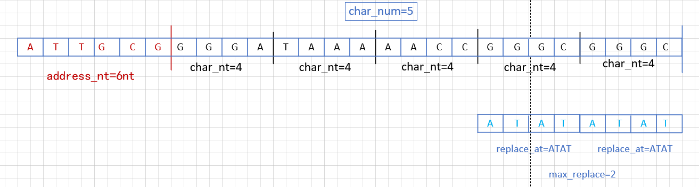

##使用教程
###1 确定所要存储的文档有多少字符
###2 确定所需要的码表。
    比如说存储一篇纯中文的文档，那么可以将gb2313码表上的字符存到DNA码表上来(在getchar.py中为具体获取哪些字符)。其中，gb2313码表上的字符只有六千多个，
    不到16384个，那么就可以使用7个nt来制作此码表,码表规模和gb2313一样大，gb2313由16bits组成。所以配置上就可以是
    char_nt=7，replace_at='ATATATA'，replace_gc='GCGCGCG'，char_bit=16。
###3 设计链。
    假如有一个120万个字符的文档，设计的链一条最多只能有60个nt，其中一条链存储6个字符，在不考损耗的情况下需要20万条链   
    来存储这个文档，20万大于4的8次方，小于4的9次方，所以用9个nt来当位置信息，总共加起来后一条链是6*7+9=51个nt，符合
    小于60的要求，下图为模板。所以配置上就可以是char_num=6，address_nt=9。

###4 参数配置
    除了上述参数必须配置，其余参数可不用配置，具体作用可以看参数后注释
###5 存储文档
    1. 制作码表。运行char_to_dna.py
    2. 将文档编码成DNA存储。运行main().py，按1，接着输入文档名称。
    注意：文档必须为txt格式，名称末尾必须为_encode，比如说jia_encode.txt这个文档，输入在程序中的文档名称为jia_encode。具体实现函数在encode.py
###6 解码DNA链
    1.运行main().py，按2，接着输入文档名称。假如文档名称是jia_encode.xlsx，则输入jia_encode。
    注意：存储DNA链的文件格式必须是xlsx。具体实现函数在decode.py

###6 验证
    1.打开verify.py，在filename1和filename2中先填写要验证的两篇文档，然后运行程序。
    

##常见问题
###1 在模拟验证时，若出现数据不一样出现的原因可能有:
    1.该码表非对应该链的设计。比如此码表是对应一条链中nt总数是51，1个字符对应的nt数是4.
    但是该码表却被应用在一条链中总数是52,1个字符对应的nt数是4。实际上就是一条链的总nt个数不一样，那么就不能用同一个码表。
    解决办法：重新运行一遍char_to_dna.py，然后继续编码解码即可。

